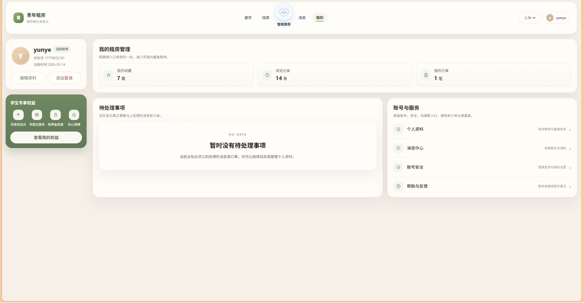
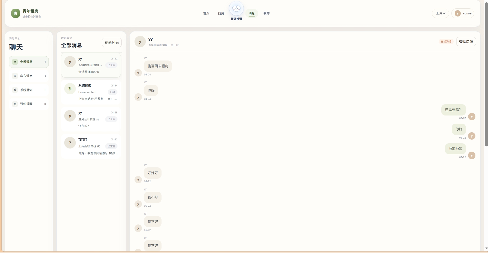
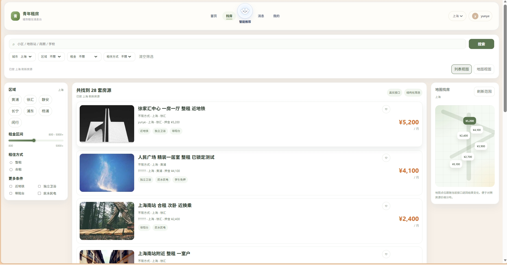
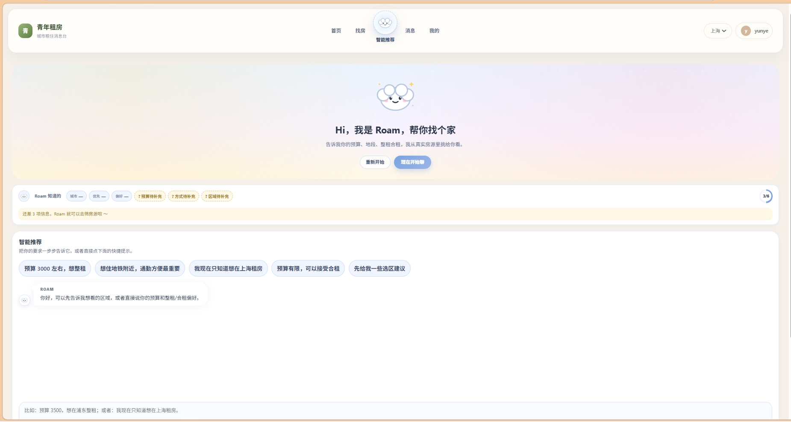

# MyRent

> 城市租住信息平台 · 前后端分离练习项目

MyRent 是一个面向年轻租客的租房平台练习项目。后端基于 Spring Boot 3，前端基于 Vue 3 + Vite，围绕租房业务核心链路做后端深度：锁房交易一致性、搜索推荐、房源 DB/ES 同步、聊天与通知。

## 页面预览

<table>
  <tr>
    <td><b>首页</b></td>
    <td><b>找房（列表 + 地图）</b></td>
  </tr>
  <tr>
    <td></td>
    <td></td>
  </tr>
  <tr>
    <td><b>AI 智能推荐</b></td>
    <td><b>消息 / 聊天</b></td>
  </tr>
  <tr>
    <td></td>
    <td></td>
  </tr>
  <tr>
    <td><b>个人中心</b></td>
    <td></td>
  </tr>
  <tr>
    <td></td>
    <td></td>
  </tr>
</table>

## 项目亮点

- **交易一致性**：Redis Lua 预占锁房 + MySQL 条件更新推进状态，本地任务表 + RabbitMQ TTL/死信队列处理订单超时，支付回调覆盖重复回调、迟到成功、重复支付等分支，退款支持重试和人工兜底。
- **搜索与推荐**：ES geo distance 附近搜索 + 关键词文本召回并发执行，多因子排序（距离、预算、相关性），三层降级链（ES → Redis 热榜 → DB），AI 推荐复用召回与排序链路。
- **数据同步**：房源变更区分核心/普通字段，核心字段走本地任务表保证先落库再投 MQ，普通字段直接投递失败写 Redis 补偿队列，每日 DB/ES 一致性校验任务兜底。
- **即时通讯**：WebSocket 多端在线管理，先写库再推送避免脏消息，游标拉取 + 历史加载 + 已读回执 + 未读统计，房源变更（价格/下架/出租）自动通知收藏用户。

## 技术栈

**后端**

| 技术 | 说明 | 官网 |
| --- | --- | --- |
| Java 17 | 开发语言 | https://www.oracle.com/java/ |
| Spring Boot 3.5.0 | Web 应用框架 | https://spring.io/projects/spring-boot |
| MyBatis-Plus 3.5.7 | ORM 框架 | https://baomidou.com/ |
| MySQL 8.x | 关系数据库 | https://www.mysql.com/ |
| Redis | 缓存与分布式锁 | https://redis.io/ |
| RabbitMQ | 消息队列 | https://www.rabbitmq.com/ |
| Elasticsearch 8.x | 搜索引擎 | https://www.elastic.co/elasticsearch/ |
| WebSocket | 实时通信 | — |
| Spring AI | AI 推荐接入 | https://spring.io/projects/spring-ai |
| Knife4j / OpenAPI | 接口文档 | https://doc.xiaominfo.com/ |
| SkyWalking | 链路观测（本地） | https://skywalking.apache.org/ |

**前端**

| 技术 | 说明 | 官网 |
| --- | --- | --- |
| Vue 3 | 前端框架 | https://vuejs.org/ |
| Vite | 构建工具 | https://vitejs.dev/ |
| Vue Router | 路由框架 | https://router.vuejs.org/ |
| Pinia | 状态管理 | https://pinia.vuejs.org/ |
| Axios | HTTP 客户端 | https://axios-http.com/ |

## 目录结构

```text
MyRent
├─ src/main/java/cn/yy/myrent
│  ├─ controller       # REST 接口
│  ├─ service          # 业务服务
│  ├─ mapper           # MyBatis-Plus Mapper
│  ├─ entity           # 实体类
│  ├─ websocket        # WebSocket 连接管理与消息推送
│  ├─ consumer         # RabbitMQ 消费者
│  ├─ sync             # 房源 DB/ES 同步与补偿任务
│  ├─ task             # 支付、退款等定时补偿任务
│  └─ config           # 项目配置
├─ src/main/resources
│  ├─ application.yml
│  ├─ mapper           # XML Mapper
│  ├─ Lua              # Redis Lua 脚本
│  └─ prompts          # AI 推荐提示词
├─ src/test/java       # 后端单元测试和 WebMvc 测试
├─ frontend            # Vue 前端
├─ sql                 # 数据库建表脚本
├─ scripts             # 热榜重建、SkyWalking 启动等脚本
└─ tools               # 本地工具目录
```

## 快速启动

### 环境准备

- JDK 17、Maven 3.8+
- Node.js 18+ / npm 9+
- MySQL 8.x、Redis、RabbitMQ、Elasticsearch 8.x

### 数据库初始化

1. 创建数据库：`CREATE DATABASE rent DEFAULT CHARACTER SET utf8mb4 COLLATE utf8mb4_0900_ai_ci;`
2. 导入表结构：`sql/rent-schema/rent-schema-all.sql`
3. 导入智能找房地点字典：`sql/rent-schema/smart-guide-location-dict.sql`

SQL 目录主要是建表脚本，不是完整演示数据包。用户可通过前端注册，房源数据建议通过接口创建。

### 配置

配置文件位于 `src/main/resources/application.yml`，启动前需按自己的环境修改数据库、Redis、RabbitMQ、Elasticsearch 等连接信息。AI 推荐默认读取环境变量 `BAILIAN_API_KEY`，建议不要把真实 key 写死在配置文件里。

> 详细配置项和参考 YAML 见 [docs/configuration.md](docs/configuration.md)。

### 启动

后端：

```powershell
mvn spring-boot:run
```

前端：

```powershell
cd frontend
npm install
npm run dev
```

前端开发环境默认通过 Vite 代理访问后端，配置位于 `frontend/.env.development` 和 `frontend/vite.config.js`。后端默认端口 `8084`，接口文档地址：http://localhost:8084/doc.html

## 测试

后端已有单元测试和 WebMvc 测试，覆盖搜索、推荐、订单、支付、退款、聊天、通知等模块。

```powershell
mvn test
```

## 本地脚本

```powershell
# 重建热门房源缓存
scripts/rebuild-hot-house-cache.ps1

# 使用 SkyWalking Agent 启动后端
scripts/run-with-skywalking.ps1
```

SkyWalking 当前定位是本地链路观测辅助工具，不代表项目已经具备完整生产级监控体系。

## 详细文档

- [架构设计与实现细节](docs/architecture.md) — 四条核心链路的详细设计、代码位置、扩展点状态、后续优先级
- [数据库表概览](docs/database.md)
- [配置说明](docs/configuration.md)
- [验证入口与操作顺序](docs/verification.md)