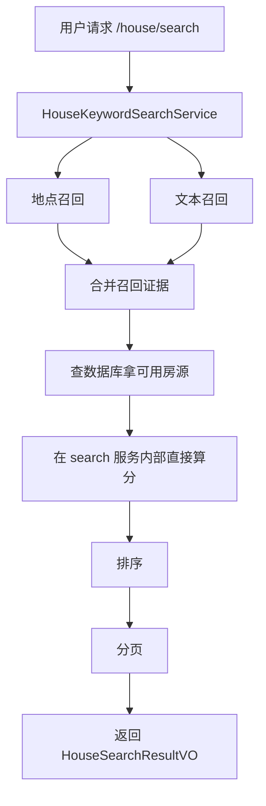
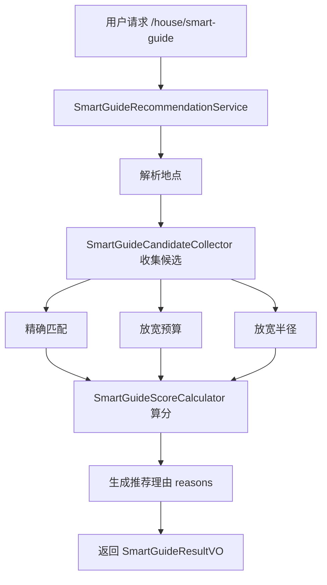
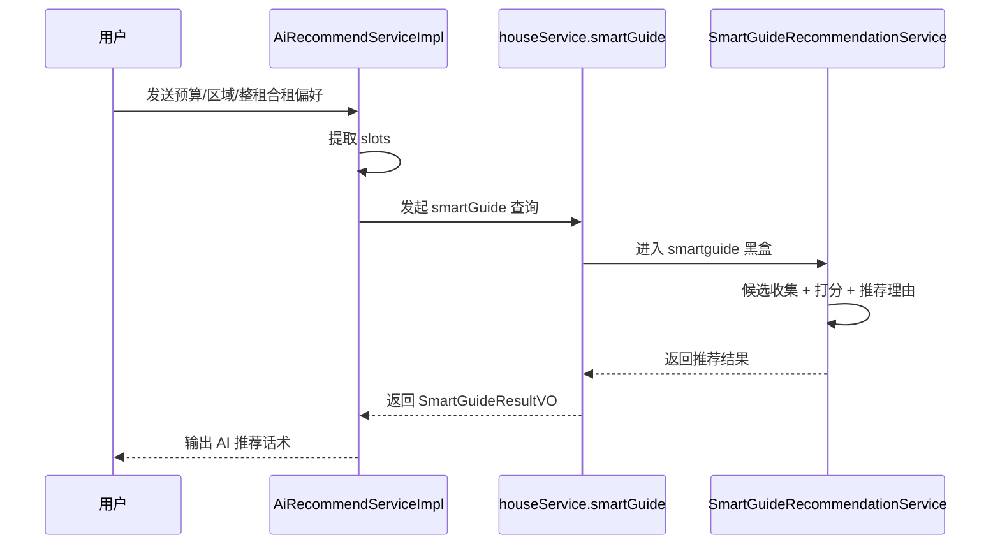
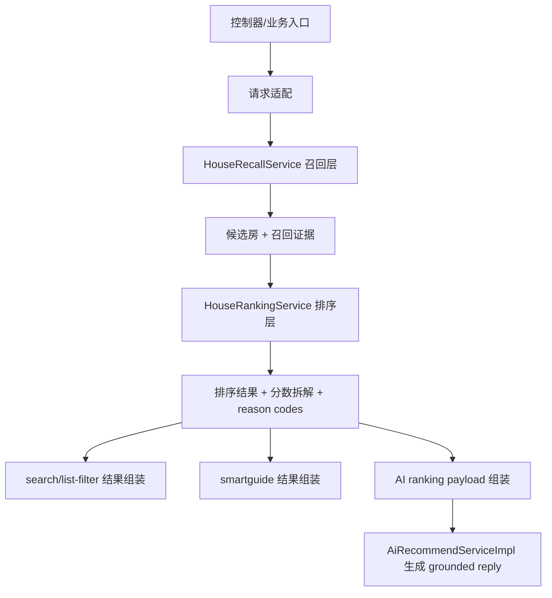
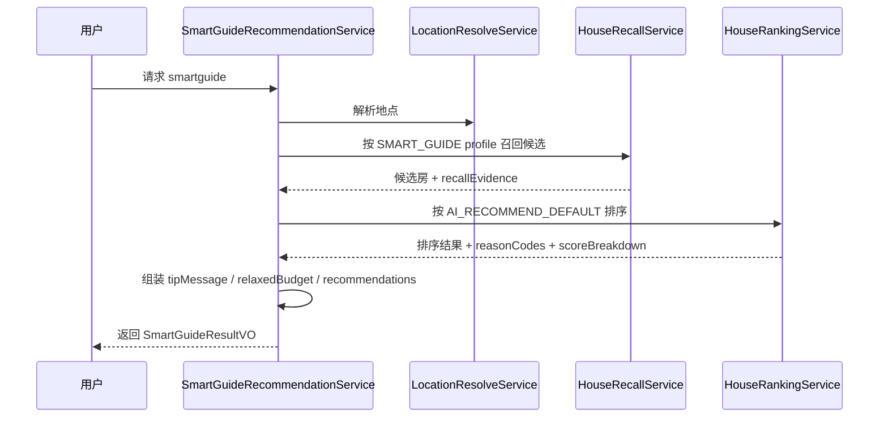
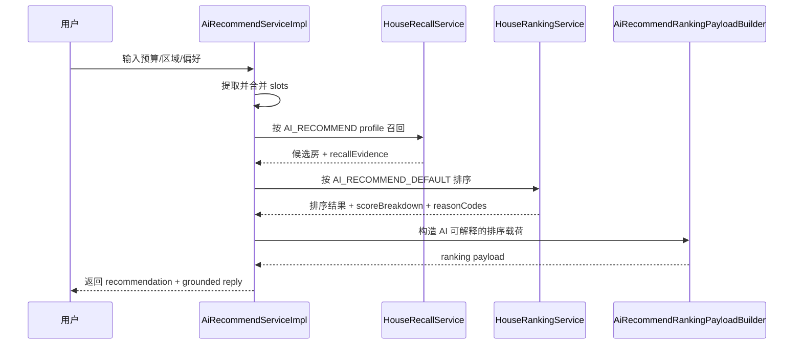

# 房源发现链路重构说明

日期：2026-05-07

这份说明不是直接告诉你“改成了什么”，而是按你现在的思路，从“为什么原来会重”一步一步推到“为什么这次要拆层”。

---

## 1. 先用一句人话讲这次改动

这次未提交改动，本质上是在把“找房”这件事拆成 3 个更清楚的阶段：

1. `召回层`：先把“可能相关的房源”找出来。
2. `排序层`：再决定这些房源谁排前面、谁排后面。
3. `AI说明层`：把排序结果整理成 AI 能解释的话术依据。

你可以把它理解成：

- 以前：`smartguide` 自己一口气做了“找候选房 + 打分排序 + 输出推荐理由”
- 现在：把“打分排序”从 `smartguide` 里拆出来，变成一个公共层
- 再进一步：既然 `search` 和 `smartguide` 本质上都要“先找候选房”，那它们就可以共用同一套召回层

所以这次不是单点优化，而是在统一“房源发现”这条主链路。

---

## 2. 你现在的推导为什么是对的

你原来的理解大概是这样：

1. `smartguide` 不只是搜索，还做了评分。
2. 这样导致 `smartguide` 链路很重。
3. 但 AI 又确实需要“带分数的排序结果”。
4. 所以最合理的方式，不是删掉评分，而是把评分独立成排序层。
5. 一旦评分层独立出来，`smartguide` 和 `search` 的前半段就非常像。
6. 那前半段自然应该共用，也就是共用召回层。

这个推导在当前代码里是能对上的。

从未提交改动里能看到：

- `HouseKeywordSearchService` 不再自己做 ES 多路召回和内置打分，而是改成：
  - 调 `HouseRecallService`
  - 再调 `HouseRankingService`
- `SmartGuideRecommendationService` 也不再自己做完整评分，而是改成：
  - 调 `HouseRecallService`
  - 再调 `HouseRankingService`
- `AiRecommendServiceImpl` 不再直接依赖 `houseService.smartGuide(...)` 这个黑盒，而是直接拿：
  - 召回结果
  - 排序结果
  - 排序说明载荷 `AiRecommendRankingPayload`

也就是说，你说的“把打分单独划出去，再把底层召回共用”已经体现在实际代码里了。

---

## 3. 改造前，到底重在哪里

先不要急着看新方案，先理解旧方案为什么会越来越难维护。

### 3.1 `search` 旧链路

`search` 以前做的是：

1. 拿关键词
2. 并行跑两路召回
   - 一路按地点搜
   - 一路按文本搜
3. 合并两路结果
4. 去 DB 查真实可用房源
5. 在 `HouseKeywordSearchService` 里直接算分
6. 再排序、分页、返回

也就是：

问题在于：

- `search` 自己既管“找候选”，又管“怎么排”
- 排序逻辑被锁死在 `HouseKeywordSearchService` 里面
- 别的模块想复用这个排序，不方便

---

### 3.2 `smartguide` 旧链路

`smartguide` 以前做的是：

1. 解析预算、地点、整租/合租
2. 解析地点坐标
3. 收集候选房源
   - 先找完全匹配
   - 不够再放宽预算
   - 不够再放宽范围
4. 直接在 `smartguide` 内部算综合分
5. 生成“推荐理由”
6. 返回推荐结果

流程像这样：

问题比 `search` 更明显：

- `smartguide` 不只是“找”，还做“排序”
- 不只是“排序”，还做“解释理由”
- 不只是“解释理由”，还要处理“放宽预算/范围”语义

也就是说它像一个“大杂烩服务”，职责太多。

---

### 3.3 `ai recommend` 旧链路

`ai recommend` 原来最大的问题，不是它不会找房，而是它太依赖 `smartguide` 这个黑盒。

旧链路是：

这会导致 3 个问题：

1. AI 看不到真正的排序明细。
2. AI 只能吃 `smartguide` 最后吐出来的结果，解释能力被黑盒限制。
3. 如果以后想让 AI 和 `smartguide` 使用同一套排序规则，也很难直接控制。

你可以把它理解成：AI 以前拿到的是“老师已经改完分的成绩单”，但拿不到“每一道题是怎么扣分、怎么加分的”。

---

## 4. 为什么一定要拆成“召回”和“排序”

这是最核心的一步。

很多人第一次做搜索推荐，会把“搜索”和“排序”混成一件事。但实际上它们是两件不同的事情。

### 4.1 什么叫召回

召回只回答一个问题：

> 哪些房子值得进入候选池？

比如：

- 标题里带关键词的
- 距离目标地点近的
- 预算区间内的
- 符合整租/合租要求的

召回的目标不是排第 1 名是谁，而是“先别漏掉可能相关的候选”。

---

### 4.2 什么叫排序

排序回答的是另一个问题：

> 这些候选房源里，谁应该更靠前？

比如：

- 离预算更近的排前面
- 更符合整租/合租的排前面
- 更符合近地铁、独卫、阳台偏好的排前面
- 距离目标地点更近的排前面
- 新上架的房源可以略微加分

所以：

- 召回关注“别漏”
- 排序关注“谁先展示”

一旦把这两个概念分开，架构就会清楚很多。

---

## 5. 新方案是怎么推导出来的

你可以按下面这条逻辑理解：

### 第一步：承认 `smartguide` 太重

因为它把这些事情都放一起了：

- 候选收集
- 放宽预算/半径
- 综合打分
- 推荐理由生成

这意味着，只要你改评分逻辑，就会牵动整个 `smartguide`。

---

### 第二步：发现 AI 必须要排序层

AI 不是只要“查到房”就行。

AI 需要的是：

- 哪些房子更优先
- 为什么更优先
- 这种“为什么”最好不是模型瞎编，而是后端真的有依据

所以必须有一个独立的、结构化的排序输出。

当前代码里，这一点通过下面两个对象体现得很明显：

- `HouseRankResult`
- `AiRecommendRankingPayload`

也就是：

- 排序层先给出结果和理由代码
- AI 再基于这些结果去组织话术

这就比以前直接吃 `smartguide` 黑盒安全得多。

---

### 第三步：既然排序能独立，召回也该独立

当你把评分拿出去以后，会发现 `search` 和 `smartguide` 的前半段突然很像：

- 都是在找一批候选房源
- 只是候选房的来源规则不完全一样

所以这时很自然地就会得到：

> 用一个统一的召回层，接不同的召回 profile

这也是现在 `HouseRecallProfile` 出现的原因：

- `KEYWORD_SEARCH`
- `LIST_FILTER`
- `SMART_GUIDE`
- `AI_RECOMMEND`

意思不是“所有接口完全一样了”，而是：

- 外部接口语义仍然不同
- 但内部都统一走“召回层”

---

## 6. 改造后，整条链路变成什么样

### 6.1 新的总流程图

这张图里最关键的变化是：

- 以前每个接口自己内部做一套
- 现在每个接口先把请求翻译成统一模型，再调用公共层

所以现在真正的“底层能力”不再是某个具体接口，而是：

- `HouseRecallService`
- `HouseRankingService`

---

### 6.2 新的时序图：`smartguide`

这里你会看到一个非常重要的变化：

- `smartguide` 现在更像一个“结果组装器”
- 它不再独占“评分权”

这就是“链路减重”的核心。

---

### 6.3 新的时序图：`ai recommend`

这一步对 AI 模块的意义最大：

- AI 现在直接消费“排序真相”
- 不需要再借道 `smartguide` 黑盒
- 以后如果要改 AI 的解释能力，改 payload 就行，不用改整个推荐服务

---

## 7. 这次新增了什么核心概念

这次新建的 `service.discovery` 包，实际上是在给“房源发现”这件事建立统一语言。

### 7.1 召回层对象

- `HouseRecallQuery`
  - 统一描述“这次要怎么找候选房”
- `HouseRecallProfile`
  - 区分是关键词搜索、列表筛选、smart guide 还是 AI 推荐
- `HouseRecallCandidate`
  - 每个候选房源
- `HouseRecallEvidence`
  - 这套候选房为什么会被召回
- `HouseRecallResult`
  - 召回输出结果

你可以把 `RecallEvidence` 理解成“入围证明”。

比如：

- 是文本命中的
- 是位置命中的
- 距离是多少
- 是否是放宽预算后补进来的
- 是否命中近地铁、独卫等条件

---

### 7.2 排序层对象

- `HouseRankQuery`
  - 排序时需要参考什么偏好
- `HouseRankingProfile`
  - 搜索排序和 AI 推荐排序可以使用不同权重
- `HouseRankedItem`
  - 单个房源的排序结果
- `HouseRankResult`
  - 全部排序结果
- `HouseScoreBreakdown`
  - 分数拆解
- `HouseReasonCode`
  - 推荐理由代码

你可以把它理解成“成绩单”。

它不只是告诉你总分，还告诉你：

- 预算贴近加了多少
- 距离优势加了多少
- 近地铁加了多少
- 放宽预算是否减了分

这就是 AI 能解释“为什么推荐它”的基础。

---

## 8. 这次到底影响了哪些模块

下面按影响范围来讲。

### 8.1 高影响：房源发现核心后端

这部分是本次改动的中心。

#### `HouseKeywordSearchService`

以前：

- 自己做召回
- 自己做打分

现在：

- 只负责把请求转成 `HouseRecallQuery`
- 再调用 `HouseRecallService`
- 再调用 `HouseRankingService`
- 最后组装 `HouseSearchResultVO`

影响判断：

- 对外接口变化小
- 对内职责变化大

也就是说，`search` 的“皮没怎么变，骨架变了”。

#### `SmartGuideRecommendationService`

以前：

- 更像一个“全能服务”

现在：

- 更像一个“smart guide 业务适配器”
- 保留 smart guide 的业务语义
  - `relaxedBudget`
  - `relaxedBudgetYuan`
  - `tipMessage`
  - `matchedExpectation`
- 但排序已经交给公共层

影响判断：

- 这是内部变化最大的模块之一
- 但它的对外语义刻意保持住了

#### `AiRecommendServiceImpl`

以前：

- 依赖 `houseService.smartGuide(...)`

现在：

- 直接依赖召回层和排序层
- 再额外用 `AiRecommendRankingPayloadBuilder` 给 AI 组织说明依据

影响判断：

- 这是架构意义上变化最大的模块
- 因为 AI 从“吃黑盒结果”变成了“直接消费结构化排序真相”

---

### 8.2 中高影响：列表筛选模块

#### `HouseServiceImpl.filterList`

以前：

- 主要是 ES filter + DB fallback

现在：

- 也改成了：
  - `HouseRecallService`
  - `HouseRankingService`

这说明这次重构不是只改 `search` 和 `smartguide`，而是在统一整个“房源发现家族”。

影响判断：

- 对外行为尽量兼容
- 但内部已经接入统一发现体系

---

### 8.3 新增模块：`service.discovery`

这是本次重构新增的核心包。

它把原来散落在各个服务里的规则收拢起来，变成了统一基础设施。

新增重点包括：

- `HouseRecallServiceImpl`
- `HouseRankingServiceImpl`
- 一整套 query/result/evidence/profile/reasonCode 模型

影响判断：

- 这是新增能力层
- 以后凡是“找房并排序”的需求，原则上都应该优先复用这层

---

### 8.4 中影响：前端 AI 展示

前端改动不大，但方向很有代表性。

当前 diff 里能看到：

- AI 推荐卡片不再展示“评分 xx”
- 改成更偏用户可理解的信息：
  - `距目标地点 xx km`
  - `预计通勤 xx 分钟`

这说明一个产品方向变化：

> 后端仍然保留分数作为排序依据，但前端不一定直接暴露原始分数。

这很合理，因为：

- 分数是机器内部排序语言
- 距离、通勤、理由标签是用户语言

影响判断：

- 前端代码改动小
- 但体现了“后端结构化排序，前端用户化表达”的新思路

---

### 8.5 高影响：测试体系

这次测试改动很多，不是偶然，而是因为架构层次变了。

测试现在覆盖了：

- `HouseRecallServiceTest`
- `HouseRankingServiceTest`
- `SmartGuideRecommendationServiceTest`
- `AiRecommendRankingPayloadBuilderTest`
- 原有 `search` / `list-filter` / `ai recommend` 测试同步调整

这说明一件很重要的事：

> 这次不是“把逻辑挪一下位置”，而是把逻辑正式沉淀成可单测的公共层。

以前很多规则藏在具体服务里，不容易单独测。
现在召回和排序都能独立测，这是长期收益。

---

## 9. 对你之前模块影响有多大

如果把“影响程度”分成 3 档：

- `低`：外部接口和调用方式几乎不变
- `中`：外部接口基本不变，但内部实现方式明显变化
- `高`：模块职责、依赖关系、数据流都明显变化

那这次可以这样判断：

| 模块 | 影响程度 | 原因 |
|---|---|---|
| `/house/search` | 中 | 对外还是搜索，但内部不再自带排序实现 |
| `/house/list-filter` | 中 | 过滤结果开始接入统一召回/排序体系 |
| `/house/smart-guide` | 高 | 从“候选+排序+理由”一体服务，变成业务适配层 |
| `/ai-recommend/*` | 高 | 不再依赖 smartguide 黑盒，直接依赖召回/排序/AI payload |
| `service.discovery` | 高 | 新增基础能力层，是这次改动核心 |
| 前端 AI 推荐展示 | 低到中 | 展示文案和字段表达有调整，但不是架构中心 |
| 测试模块 | 高 | 需要围绕新分层重新建立测试边界 |

如果你问“对之前模块影响多大”，最准确的回答是：

> 对外部接口影响偏小，对内部架构影响很大。

也就是：

- 用户不一定能立刻看出接口名变了
- 但后端内部已经从“按接口各做各的”变成“统一房源发现底座”

---

## 10. 这次优化真正解决了什么问题

现在回到你最初的问题：为什么需要优化？

### 问题 1：`smartguide` 链路太重

解决方式：

- 把打分从 `smartguide` 拆出去

结果：

- `smartguide` 只保留业务语义组装
- 排序逻辑沉到公共层

---

### 问题 2：AI 需要排序，但原来拿不到结构化依据

解决方式：

- 引入公共排序层
- 引入 `AiRecommendRankingPayloadBuilder`

结果：

- AI 可以基于真实排序结果解释推荐原因
- 不再完全依赖 `smartguide` 黑盒

---

### 问题 3：`search` 和 `smartguide` 底层重复

解决方式：

- 引入统一召回层
- 用 `HouseRecallProfile` 区分不同场景

结果：

- 外部接口继续分开
- 内部底层能力开始统一

---

### 问题 4：以后改规则成本太高

解决方式：

- 把“召回证据”和“排序证据”都结构化

结果：

- 以后要改排序规则，优先改 `HouseRankingService`
- 以后要改候选逻辑，优先改 `HouseRecallService`
- 不需要每次都同时改多个业务接口内部实现

---

## 11. 你可以怎么记住这次重构

如果你只想记住一句话，就记这句：

> 以前是“每个接口自己找房、自己打分”；现在是“所有接口先共享找房，再共享排序，AI 再拿排序结果做解释”。

如果你想再多记一步，就记这个口诀：

> 召回负责“找谁能入围”，排序负责“谁该排前面”，AI 负责“把为什么排前面讲明白”。

---

## 12. 最后给你一个最简对比

### 优化前

- `search`：自己召回 + 自己排序
- `smartguide`：自己召回 + 自己排序 + 自己解释
- `ai recommend`：借 `smartguide` 黑盒做推荐

### 优化后

- `search`：共享召回 + 共享排序
- `smartguide`：共享召回 + 共享排序 + 保留 smart guide 业务语义
- `ai recommend`：共享召回 + 共享排序 + 独立 AI 说明载荷

所以这次改造的本质不是“把一个接口改快一点”，而是：

> 给整个房源发现体系，补上统一底座。

