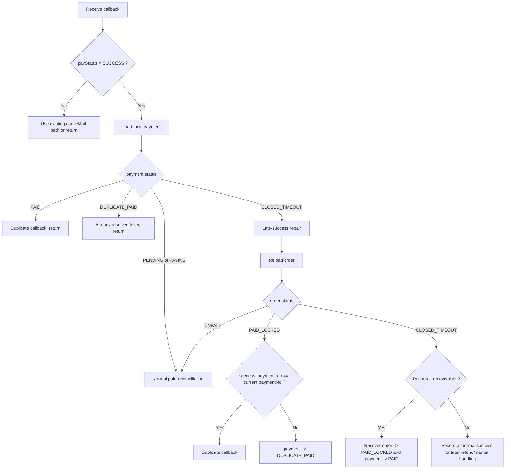
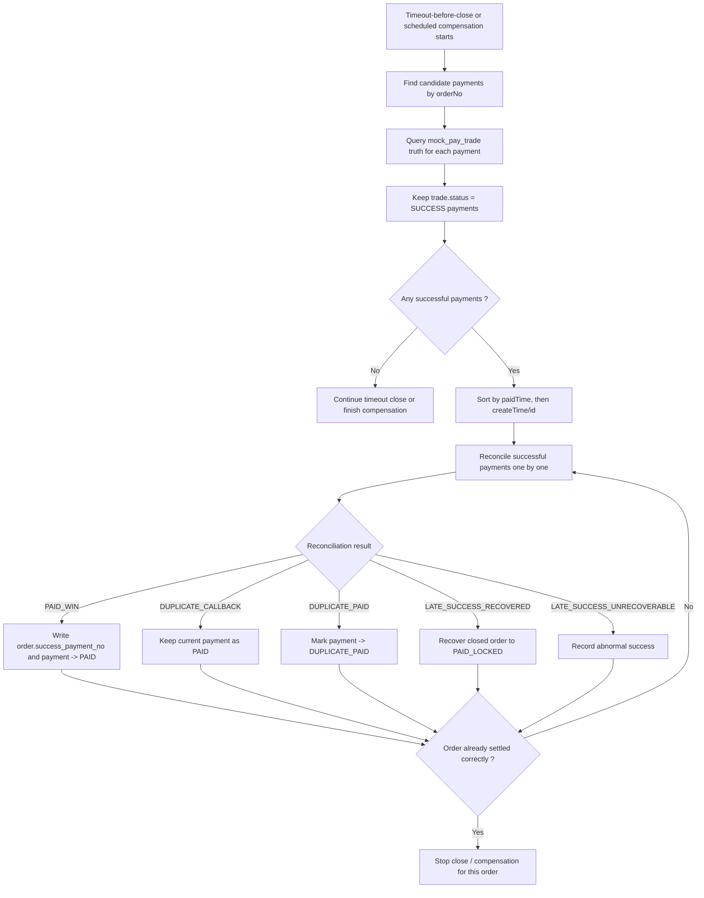

# Payment Anomaly Repair Design

**Goal:** Repair the two remaining payment-anomaly gaps in the current mock payment flow without changing the current main-path testing model where one order may still create multiple payment records.

This design only solves:

- problem 1: late `SUCCESS` after timeout close
- problem 2: wrong payment selected during pre-close check or compensation

This design intentionally does **not** introduce the rule "one order can only have one active payment at a time" in this iteration, because the current project still needs multi-payment behavior for ongoing testing.

---

## 1. Scope And Principles

### 1.1 In Scope

- repair late-success handling after local timeout close
- repair candidate-payment selection for timeout-before-close and compensation
- keep current `one order -> many payment` data model
- keep current main-path testability for repeated payment creation
- unify success reconciliation logic across callback, timeout-before-close, and scheduled compensation

### 1.2 Out Of Scope

- limiting one active payment per order
- redesigning the main repay entry behavior
- refunds implementation
- manual-review workflow implementation
- anti-repeat-click control
- real Alipay / WeChat integration

### 1.3 Final Truth Roles

- `order` stores final business result
- `payment` stores payment-attempt records
- `mock_pay_trade` stores third-party truth

### 1.4 Core Repair Rules

1. This iteration keeps the current model where one order may contain many payments.
2. The design only repairs anomaly handling; it does not change the current test-oriented payment creation strategy.
3. Any confirmed third-party success must enter one unified local reconciliation path.
4. Multiple successful payments for one order must be reconciled in deterministic sequence, not in parallel.
5. `order` remains the final business owner of success through CAS and `success_payment_no`.

---

## 2. Problem 1: Late SUCCESS After Timeout Close

### 2.1 Problem Definition

Current callback handling may discard a true third-party success when:

1. the payment already succeeded on the mock third-party side
2. callback processing was delayed, lost, or failed locally
3. timeout close ran first and changed local `order` / `payment` into timeout-closed state
4. the later callback finally arrives with `SUCCESS`
5. local code returns early because local payment already looks terminal

This is not mainly a "wrong active query" problem. It is a time-order / eventual-consistency problem:

- local timeout close happened first
- third-party success truth arrived later

### 2.2 Desired Behavior

If third-party callback reports `SUCCESS`, local `CLOSED_TIMEOUT` must not automatically block repair.

The system must:

- accept the success fact
- enter late-success repair logic
- decide whether the closed order can still be restored

### 2.3 Callback Success Handling Rules

When callback result is `SUCCESS`, callback processing should branch by local payment state:

- `PAID`
  - treat as duplicate callback
  - return success directly
- `DUPLICATE_PAID`
  - already resolved as losing successful payment
  - return success directly
- `PENDING` or `PAYING`
  - enter normal paid reconciliation
- `CLOSED_TIMEOUT`
  - do **not** return directly
  - enter late-success repair logic

This means:

- terminal short-circuit still exists for `PAID` and `DUPLICATE_PAID`
- `CLOSED_TIMEOUT` becomes a special exception when callback says `SUCCESS`

### 2.4 Late-Success Repair Logic

When local payment is `CLOSED_TIMEOUT` and callback says `SUCCESS`:

1. reload current `order`
2. branch by current `order.status`

#### Case A: `order.status = UNPAID`

- treat as normal success reconciliation
- try order CAS from `UNPAID -> PAID_LOCKED`

#### Case B: `order.status = PAID_LOCKED`

- read `success_payment_no`
- if it equals current `paymentNo`
  - duplicate callback
- if it does not equal current `paymentNo`
  - current payment becomes `DUPLICATE_PAID`

#### Case C: `order.status = CLOSED_TIMEOUT`

- enter closed-order recovery check

### 2.5 Closed-Order Recovery Check

The user chose this strategy for the spec:

- if business resource is still recoverable, restore the order to paid
- otherwise keep order closed and record abnormal success for later handling

So the logic is:

1. check whether order resource can still be recovered
2. if recoverable:
   - recover order from `CLOSED_TIMEOUT -> PAID_LOCKED`
   - write `success_payment_no`
   - mark current payment as `PAID`
3. if not recoverable:
   - do not force order back to paid
   - record abnormal success result
   - leave later refund / manual handling entry

### 2.6 Flowchart

---

## 3. Problem 2: Wrong Payment Selected During Query / Compensation

### 3.1 Problem Definition

Current timeout-before-close and compensation logic can make the wrong decision when one order contains multiple payments.

The current weakness is not "there is no active query." The weakness is:

- active query only looks at one payment
- usually the latest active payment
- but the actually successful payment may be an older one

That creates this risk:

1. `P1` already succeeded on third-party side
2. callback for `P1` was not processed locally
3. `P2` was created later
4. timeout-before-close checks only `P2`
5. system misses successful `P1`
6. order may be closed incorrectly

### 3.2 Desired Behavior

Timeout-before-close and scheduled compensation must stop using "latest active payment only."

Instead they must:

1. find candidate payments by `orderNo`
2. query third-party truth for each candidate
3. identify all third-party-successful payments
4. sort them in deterministic order
5. reconcile them one by one
6. let order CAS decide the only final winner

### 3.3 Candidate Payment Selection

Add order-level candidate selection for:

- timeout-before-close
- scheduled compensation

Minimum candidate scope for this iteration:

- payments under the order that may still affect final truth
- at least:
  - `PENDING`
  - `PAYING`
  - `CLOSED_TIMEOUT`

Reason:

- `PENDING / PAYING` covers normal lost-callback repair
- `CLOSED_TIMEOUT` covers late-success after local timeout close

This spec intentionally prioritizes correctness of anomaly handling over minimal scan range.

### 3.4 Third-Party Truth Filtering

For each candidate payment:

1. load corresponding `mock_pay_trade`
2. keep only payments where trade truth is `SUCCESS`
3. ignore non-success payments for paid reconciliation

Important:

- selection must be based on third-party truth
- not based on local `payment.status = PAID`
- because local state may be stale exactly in these anomaly scenarios

### 3.5 Deterministic Reconciliation Order

If more than one successful payment exists for the same order:

- do not reconcile in parallel
- reconcile sequentially in stable order

Recommended order:

1. `paidTime` ascending
2. if tie or null, `payment.id` or `createTime` ascending

This gives:

- predictable behavior
- stable logs
- stable tests

### 3.6 Unified Reconciliation Results

Each successful payment enters one common success reconciliation method.

Possible outcomes:

- `PAID_WIN`
  - current payment wins order success
- `DUPLICATE_CALLBACK`
  - current payment was already the winner
- `DUPLICATE_PAID`
  - current payment also succeeded but lost order ownership
- `LATE_SUCCESS_RECOVERED`
  - order was timeout-closed and then recovered
- `LATE_SUCCESS_UNRECOVERABLE`
  - third-party success confirmed but order cannot be recovered

### 3.7 Timeout Consumer Change

Timeout-before-close must change from:

- check latest active payment only

to:

1. load candidate payments by `orderNo`
2. query mock trade truth for each candidate
3. collect successful payments
4. if success list is not empty:
   - reconcile them in sequence
   - if order becomes paid, stop closing
5. only when success list is empty:
   - continue timeout close

### 3.8 Scheduled Compensation Change

Scheduled compensation must also move from single-payment mindset to order-level candidate mindset.

Recommended minimal behavior:

1. scan suspicious unpaid orders or suspicious candidate payments
2. group by `orderNo`
3. load candidate payments for the order
4. identify third-party successful payments
5. reconcile them in deterministic order

### 3.9 Flowchart

---

## 4. Concrete Landing Strategy

### 4.1 Callback Refactor

Refactor callback success handling into two explicit internal branches:

- normal paid reconciliation
- late-success-after-timeout repair

Recommended helper split:

- `closeOrderAsPaidNormally(...)`
- `repairLateSuccessAfterTimeout(...)`

This keeps normal path and anomaly path separate and testable.

### 4.2 Unified Success Reconciliation Entry

All third-party-success entry points should call one common reconciliation service:

- callback success path
- timeout-before-close path
- scheduled compensation path

Recommended conceptual input:

- `paymentNo`
- `thirdPartyTradeNo`
- `effectivePaidTime`
- source type

Recommended conceptual result:

- `PAID_WIN`
- `DUPLICATE_CALLBACK`
- `DUPLICATE_PAID`
- `LATE_SUCCESS_RECOVERED`
- `LATE_SUCCESS_UNRECOVERABLE`

### 4.3 Mapper Changes

Add candidate-payment query by order:

- `selectCandidatePaymentsByOrderNo(orderNo)`

This replaces using only:

- latest active payment query

The new mapper must support order-level candidate selection for anomaly repair.

### 4.4 Timeout Consumer Changes

Timeout consumer should:

1. load order
2. if not unpaid, stop
3. load candidate payments by `orderNo`
4. identify third-party successful payments
5. reconcile in order
6. if order becomes paid, stop timeout close
7. otherwise continue closing order, payments, trades, and releasing house

### 4.5 Compensation Task Changes

Compensation task should:

1. scan suspicious orders or payments
2. load candidate payments by `orderNo`
3. identify successful third-party payments
4. reconcile in deterministic sequence

### 4.6 Recoverability Check

Because this spec chooses "recover if resource is still available," add an explicit check point:

- `canRecoverClosedOrder(order)`

Minimal semantic meaning:

- house/resource is still recoverable
- order may still transition back to paid
- third-party success fact is trustworthy

Implementation may remain simple in this iteration, but the check point must exist explicitly in the design.

### 4.7 Minimum Tests

Required tests for this iteration:

1. payment is `CLOSED_TIMEOUT`, callback says `SUCCESS`, resource recoverable
   - order recovers to `PAID_LOCKED`

2. payment is `CLOSED_TIMEOUT`, callback says `SUCCESS`, resource not recoverable
   - abnormal-success result is recorded

3. same order has `P1` successful and `P2` not successful
   - timeout-before-close / compensation must detect `P1`

4. same order has `P1` successful and `P2` successful
   - only one winner remains
   - other successful payment becomes `DUPLICATE_PAID`

5. timeout-before-close with many candidate payments
   - any successful candidate prevents wrong timeout close

---

## 5. Final Summary

This design keeps the current project model unchanged at the main-path level:

- one order may still contain many payments
- no new "single active payment" restriction is introduced now

It only repairs two concrete anomaly gaps:

1. late third-party `SUCCESS` after local timeout close must not be discarded
2. active query / compensation must stop looking at only the latest payment and must instead identify successful payments at order level

With these repairs:

- callback, timeout-before-close, and compensation all converge on one success reconciliation path
- multiple successful payments are settled deterministically
- order CAS and `success_payment_no` remain the final ownership control
- late success can recover a closed order when resource is still recoverable
