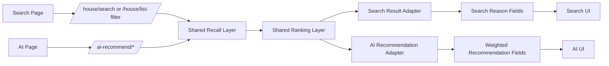

# Search Reason Rendering and AI Weighted Recommendation Design

Date: 2026-05-07

## Background

The current house discovery stack has already been refactored internally into shared recall and ranking layers, but the frontend does not yet fully expose the difference between:

- search results that are ordered by relevance
- recommendation results that are ordered by suitability

This causes two practical product problems:

1. Search results look like a plain list of houses, so users cannot easily understand why the first result is ranked first.
2. AI recommendation already has backend evidence and recommendation reasons, but it still behaves too much like "condition matched => result returned" rather than "the system understood the user's trade-offs and prioritized accordingly."

The user has now simplified the product surface:

- the standalone smart-guide page is no longer the main product surface
- the active surfaces are:
  - the search page
  - the AI recommendation page

This creates a clearer product architecture:

- search page should explain lightweight relevance
- AI page should explain stronger recommendation logic and preference prioritization

The next iteration should keep the current internal three-layer discovery architecture, but make it visible and meaningful in the frontend.

## Confirmed Product Decisions

The following decisions are fixed for this iteration:

1. Search page results must render lightweight search reasons in the frontend.
2. Search page reasons should explain why a house is relevant, not why it is globally "best for you."
3. AI recommendation should move beyond simple condition satisfaction and reflect stronger preference weighting.
4. AI input should continue to support natural-language expressions such as:
   - "I care more about commute"
   - "budget can be slightly relaxed"
   - "balcony would be nice to have"
5. This iteration should use the 2.5 weighting model:
   - `HIGH`
   - `MEDIUM`
   - `LOW`
   - optional `relaxable`
6. This iteration must explicitly reserve extension points for a future upgrade to full scheme 3.
7. Search and AI must remain distinct user experiences:
   - search = help me find
   - AI = help me choose
8. Existing routes should remain in place.
9. This stage is design-only; no implementation or commit is part of this spec itself.

## Goals

- Make search ordering understandable to users with lightweight frontend explanations.
- Make AI recommendation visibly stronger than search by supporting explicit preference weighting.
- Preserve natural-language flexibility while translating it into a bounded ranking model.
- Reuse the current recall/ranking foundation instead of introducing a separate recommendation engine.
- Add explicit contract fields that allow future upgrade to scheme 3 without breaking current work.

## Non-Goals

- No fully autonomous agentic planning for housing.
- No complete scheme 3 implementation in this iteration.
- No user-visible numerical score exposure on the search page.
- No heavy "TOP recommendation" style on the search page.
- No removal of current recall/ranking abstractions.
- No new dedicated recommendation page requirement.

## Product Framing

This iteration formalizes the product distinction:

### Search Page

Search answers:

- "Given what I typed or filtered, which houses are most relevant?"

Search should explain:

- keyword match
- location match
- nearby match
- structured filter match

Search should not behave like:

- a strong personalized recommender
- a decision-making assistant

### AI Recommendation Page

AI recommendation answers:

- "Given my overall needs and trade-offs, which houses should I look at first?"

AI recommendation should explain:

- which requirements were prioritized
- which requirements were secondary
- what was slightly relaxed
- why these houses are better choices under the current priority model

This distinction is the main product reason for the new frontend and ranking changes.

## Current Problems

## 1. Search Page Problem

The current search page:

- shows house facts
- shows house feature tags
- shows total count and current mode

But it does not show:

- why this house ranked above the next one
- whether ranking came from keyword match, location match, or both

So the user sees ordering without explanation.

## 2. AI Recommendation Problem

The current AI recommendation pipeline:

- can extract slots from natural language
- can carry `priority`
- can carry `preferences`
- can produce recommendation reasons

But the current ranking behavior still mostly treats preferences as simple presence flags:

- `nearSubway = true`
- `hasBalcony = true`
- `privateBathroom = true`

This is not enough to represent language like:

- "commute matters more than balcony"
- "budget can be slightly relaxed"
- "whole rent preferred, but shared is acceptable if much cheaper"

So AI recommendation is directionally correct but not yet decisively stronger than search.

## Core Design Decision

This iteration should implement:

1. lightweight search reason rendering
2. bounded AI preference weighting
3. explicit future extension points for richer trade-off reasoning

The design deliberately uses a bounded internal weighting system rather than a free-form semantic weighting engine.

This gives:

- better product differentiation now
- manageable implementation complexity now
- upgrade path later

## Architecture Overview



## Part 1: Search Reason Rendering

## Search UX Intent

Search should communicate:

- "This is why the result is relevant"

It should not communicate:

- "This is the best house for you overall"

The tone must stay lightweight and factual.

## Search Backend Contract Direction

Current search responses return:

- `total`
- `houses`
- `esDown`
- `fallbackSource`
- `tipMessage`

Current `HouseVO` does not expose search ranking reasons.

This iteration should add optional outward fields to `HouseVO` for search explanation.

### Recommended Additive Fields on `HouseVO`

- `searchReasons: List<String>`
- `searchReasonCodes: List<String>` optional internal-facing / debugging-facing support field
- `searchReasonSummary: String` optional future-use field, not required to render in this iteration

The frontend only needs `searchReasons` in this iteration.

### Reason Code Sources

Search reasons should be derived from existing ranking and recall evidence, not invented by the frontend.

The mapping should primarily use:

- `RECALL_LOCATION_MATCH`
- `RECALL_TEXT_MATCH`
- `LOCATION_DISTANCE_ADVANTAGE`
- `TEXT_RELEVANCE_ADVANTAGE`
- `NEAR_SUBWAY_MATCH`
- other structured search filter hits when applicable

### Search Reason Output Rules

Search reasons should be:

- short
- factual
- relevance-oriented
- limited to at most 2 visible reasons by default

Recommended outward reason text examples:

- `关键词命中`
- `位置匹配`
- `同时命中关键词与位置`
- `距目标地点约 1.2km`
- `近地铁条件命中`
- `独立卫浴条件命中`

Search reasons should avoid recommendation wording such as:

- `更适合你`
- `优先推荐`
- `最值得先看`

## Search Frontend Rendering Design

### Page-Level Summary Copy

The search results summary area should gain explicit ordering explanation.

Examples:

- `已按关键词匹配度和位置相关性排序`
- `优先展示同时命中关键词与位置的房源`
- `已结合关键词、位置和筛选条件排序`

The exact copy can vary by mode:

- keyword search mode
- structured filter mode

### Card-Level Rendering

Current card tags already render house feature tags. This should be split conceptually into:

1. search reasons
2. house features

Recommended card order:

1. title
2. room/meta information
3. search reason row
4. house feature row
5. price

If layout space is tight:

- search reason row should render first
- feature tags should stay second

### Visual Hierarchy

Search reasons should be visually lighter than AI recommendation reasons:

- softer background
- lower emphasis
- smaller count

Recommended label style direction:

- muted green or sand-tinted outline pills
- prefix is not required
- optional subtle section label such as `排序依据`

## Search Mode Differences

### `/house/search`

Reason priority:

1. keyword and location dual match
2. keyword match
3. location proximity
4. optional filter hit

### `/house/list-filter`

Reason priority:

1. structured condition hit
2. location relevance if available
3. optional proximity or freshness

`/house/list-filter` should still not feel like recommendation. Its reasons should read like:

- `近地铁条件命中`
- `独立卫浴条件命中`
- `价格区间匹配`

not like:

- `通勤更适合`
- `更符合你的偏好权重`

## Part 2: AI Weighted Recommendation 2.5 Design

## Why 2.5 Instead of Full Scheme 3

This iteration should support natural language and stronger trade-off handling, but must stay bounded and testable.

The 2.5 model means:

- natural-language understanding stays rich
- internal ranking execution is normalized into a bounded model

This bounded model is:

- weight level: `HIGH`, `MEDIUM`, `LOW`
- optional relaxation flag

This is the implementation center of gravity for this iteration.

## AI Weighting Concept

The system should distinguish between:

### Hard Requirement

A condition that must be satisfied or strongly dominates ranking.

Examples:

- "必须近地铁"
- "整租优先"

### Strong Preference

A condition that strongly influences ranking but may not be absolute.

Examples:

- "我更在意通勤"
- "独立卫浴比较重要"

### Soft Preference

A condition that adds value but should not dominate trade-offs.

Examples:

- "阳台最好有"
- "有的话更好"

### Relaxable Constraint

A condition that can be loosened within controlled semantics.

Examples:

- "预算可以稍微放一点"
- "实在没有整租可以看合租"

## Recommended Internal Weight Model

This iteration should add explicit normalized structures instead of relying only on `priority + preferences`.

### Recommended New Internal Types

- `AiPreferenceWeightLevel`
  - `HIGH`
  - `MEDIUM`
  - `LOW`

- `AiPreferenceWeight`
  - `preferenceKey`
  - `weightLevel`
  - `relaxable`

- optional `AiConstraintInterpretation`
  - for internal orchestration only

### Recommended Slot Direction

Current `AiRecommendSlots` should be extended or complemented so that backend can represent:

- base slots
- normalized weighted preferences
- optional constraint relaxation intent

Recommended structure direction:

```json
{
  "locationName": "豫园",
  "budgetYuan": 4500,
  "budgetScope": "RENT_ONLY",
  "rentMode": "WHOLE",
  "priority": "COMMUTE",
  "preferences": ["nearSubway", "hasBalcony"],
  "weightedPreferences": [
    { "preferenceKey": "nearSubway", "weightLevel": "HIGH", "relaxable": false },
    { "preferenceKey": "hasBalcony", "weightLevel": "LOW", "relaxable": true }
  ],
  "relaxationHints": {
    "budget": true,
    "rentMode": false
  }
}
```

The exact Java type shape may vary, but the system must retain this semantics.

## AI Natural-Language Understanding Behavior

The AI system must continue to support conversational language.

Examples:

- `我更在意通勤，预算可以稍微放一点`
- `近地铁最重要，阳台有最好，没有也行`
- `整租优先，实在不行再看看合租`

The model or backend interpretation layer must normalize these into bounded weight semantics.

Important clarification:

- natural-language richness is preserved
- execution semantics are bounded

This is the central principle of scheme 2.5.

## Prompt and Decision Design Changes for AI

The AI extraction pipeline should be upgraded so that slot extraction supports weighting semantics.

### Prompt Contract Direction

The model output should continue to be structured, but now should also support weighted preference understanding.

Recommended output extension direction:

```json
{
  "reply": "string",
  "slots": {
    "city": null,
    "locationName": null,
    "budgetYuan": null,
    "budgetScope": null,
    "rentMode": null,
    "priority": null,
    "preferences": [],
    "weightedPreferences": [],
    "relaxationHints": {}
  }
}
```

If full direct structured generation for weighted preferences is too brittle, the backend may first:

1. extract `priority + preferences + reply`
2. normalize weighted preferences in backend rules

This is acceptable as long as the final backend state carries explicit weight semantics.

## Ranking Layer Integration for AI

The ranking layer currently uses boolean preference hits.

This iteration should evolve the ranking query contract so weighted preferences can affect score contribution more clearly.

### Recommended Ranking Query Direction

Current query supports:

- `nearSubway`
- `privateBathroom`
- `hasBalcony`
- `civilWaterElectric`
- `supportStudentDepositFree`

The new design should support either:

1. additive weight multipliers per preference
2. normalized high/medium/low score contribution mapping

Recommended bounded score policy:

- `HIGH` preference match: strongest bonus
- `MEDIUM` preference match: moderate bonus
- `LOW` preference match: light bonus

Additionally:

- `HIGH` non-match may imply stronger opportunity cost
- `LOW` non-match should not severely hurt ranking

### Example Weight Influence

For AI recommendation:

- `nearSubway = HIGH`
- `hasBalcony = LOW`

then:

- a near-subway listing should outrank a balcony-only listing
- even if the balcony listing matches more secondary facts

This is the intended behavioral distinction from the search page.

## AI Recommendation Reason Design

AI recommendation reasons should become heavier and more decision-oriented than search reasons.

### Reason Groups

Recommended reason groups:

1. `Primary fit reasons`
2. `Secondary fit reasons`
3. `Relaxation reasons`

### Example Output Reasons

Primary:

- `优先满足近地铁需求`
- `月租更贴近预算`
- `整租需求匹配`

Secondary:

- `带阳台`
- `独立卫浴`
- `民水民电`

Relaxation:

- `预算已轻度放宽`
- `当前完全匹配较少，已扩大候选范围`

The frontend does not need to label these groups visually in a heavy dashboard style, but the backend should distinguish them semantically.

## AI Frontend Rendering Design

The AI page should clearly feel different from search.

### Card Copy Direction

Recommended presentation order:

1. title
2. core pricing
3. one-line primary recommendation summary
4. metric line
5. primary reason tags
6. secondary reason tags
7. optional relaxation note

### Example UX Copy

- `这套优先满足你的通勤需求，且租金更贴近预算`
- `已优先按整租和近地铁排序`
- `当前完全匹配较少，预算已轻度放宽`

### Visual Direction

Compared with search reasons:

- AI reasons may use stronger emphasis
- primary reasons may be more saturated
- relaxation notices may use amber warning tone

The goal is to make AI feel like a guided recommendation flow rather than a plain result list.

## Future Scheme 3 Extension Plan

This iteration must explicitly preserve upgrade space for full scheme 3.

Scheme 3 is not implemented now, but the spec must leave room for it.

### Scheme 3 Capability Direction

Future scheme 3 may support:

- finer-grained preference strengths
- explicit relaxation limits
- trade-off policy storage
- conflict-aware ranking decisions
- recommendation explanations that describe what was sacrificed or relaxed to satisfy a stronger need

### Recommended Future Extension Fields

The design should reserve optional space for:

- `relaxLimit`
- `constraintPriorityMap`
- `tradeoffReason`
- `satisfactionLevel`
- `partiallySatisfiedConstraints`
- `unsatisfiedButAcceptedConstraints`

### Example Future Semantics

User:

- `通勤最重要，预算最多多 300，阳台不值得额外多花钱`

Future scheme 3 should be able to represent:

- commute is dominant
- budget overflow cap is 300
- balcony is weak and should not override commute or budget
- recommendation explanation can explicitly say:
  - `为了优先保证通勤，接受了约 200 元预算上浮`

### Current Iteration Boundary

This iteration must not attempt to fully implement those fine-grained mechanics.

Instead it should:

1. reserve field space
2. keep normalization extensible
3. avoid hardcoding logic that blocks a future transition

## API Contract Direction

## Search Response Direction

`HouseVO` additive outward fields:

- `searchReasons`
- optional `searchReasonCodes`

These should remain optional and non-breaking.

## AI Response Direction

`SmartGuideResultVO` outward compatibility may remain, but AI recommendation items should gain more structured reason semantics internally.

If useful, outward fields may be extended later with:

- `primaryReasons`
- `secondaryReasons`
- `relaxationNotes`

This iteration may either:

1. expose them directly
2. or continue mapping them into `reasons` while preserving internal distinction for future use

The preferred direction is:

- keep compatibility outward where possible
- preserve richer internal structure now

## Frontend Component Boundaries

## Search Page

Main file:

- `frontend/src/views/HouseListView.vue`

Needs:

- result summary explanation area
- search reason row in result cards
- feature tag row remains

### Recommended Component Boundary

If the search card grows too dense, consider extracting:

- `SearchReasonTagRow`

But this is optional for this iteration.

## AI Recommendation Page

Main files:

- `frontend/src/views/AiRecommendView.vue`
- `frontend/src/components/ai/AiRecommendationPanel.vue`

Needs:

- stronger reason grouping semantics
- visible primary fit reasons
- visible secondary fit reasons
- visible relaxation note when applicable

## Testing Strategy

## Search Backend Tests

Add or update tests for:

1. search reasons are generated from ranking/recall evidence
2. dual keyword+location hits produce strong search reasons
3. list-filter results can expose structured filter reasons
4. no recommendation-style language leaks into search reason mapping

## Search Frontend Tests

Add or update tests for:

1. result summary shows ordering explanation in keyword mode
2. card renders search reasons separately from house feature tags
3. search reason count remains bounded

## AI Backend Tests

Add or update tests for:

1. natural-language preferences normalize into `HIGH/MEDIUM/LOW`
2. relaxable intent is preserved
3. high-priority match outranks low-priority-only match
4. AI recommendation reasons distinguish primary vs secondary fit
5. current implementation remains backward compatible when weighted preference data is missing

## AI Frontend Tests

Add or update tests for:

1. AI recommendation renders stronger reasons than search page
2. relaxation notice displays when recommendation used budget/range relaxation
3. primary and secondary reason grouping is visible or semantically preserved

## Regression Focus

Must preserve:

- current search route behavior
- current AI chat route structure
- current recommendation rendering baseline
- current fallback behavior when AI cannot complete recommendation

## Implementation Phasing

### Phase 1: Search Reason Exposure

- extend backend search result mapping
- expose search reasons
- render page-level ordering explanation
- render card-level search reasons

### Phase 2: AI Weight Normalization

- add bounded preference weight structures
- normalize natural-language preference strength
- adapt ranking layer to use bounded weight levels
- expose richer recommendation reasons

### Phase 3: Future Scheme 3 Readiness

- add extension-friendly field design
- document reserved semantics
- ensure no hardcoded logic blocks later trade-off reasoning expansion

## Risks and Trade-Offs

### 1. Search Over-Explanation Risk

If search reasons become too heavy, the search page may feel like recommendation. This must be avoided by keeping wording lightweight.

### 2. AI Under-Differentiation Risk

If AI weighting remains too close to simple boolean matching, users will not feel that AI is meaningfully smarter than search.

### 3. Weight Normalization Brittleness

Natural language may not always map cleanly to `HIGH/MEDIUM/LOW`. Backend normalization and prompt constraints must therefore be conservative and testable.

### 4. Future Scheme 3 Drift

If current 2.5 fields are too rigid, upgrading later will be painful. This is why explicit extension hooks are required now.

## Success Criteria

This design is successful when:

- search results visibly explain lightweight relevance in the frontend
- the first search results no longer feel arbitrarily ordered
- AI recommendation visibly reflects condition weighting
- AI recommendation feels stronger than plain condition matching
- natural-language preference phrasing remains supported
- the 2.5 model is implemented without blocking future scheme 3 evolution
- search stays search
- AI recommendation clearly feels like recommendation

